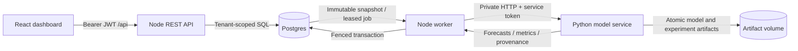

# Architecture and integration

The browser communicates only with Node. Node validates a signed JWT, derives the tenant from the token, and enforces trainer permissions on writes. It never accepts a tenant identity from a request body. Every series, observation, job and run query is scoped by this identity. Database roles are infrastructure roles; application roles are `reader` and `trainer`.

Ingestion stores observations under a series with a declared UTC daily or hourly frequency. A retraining request snapshots the entire observed series and bounded experiment configuration inside a durable Postgres job. Later ingestion cannot alter an already queued experiment. Worker claims use row locks and `SKIP LOCKED`, refresh a lease while the private model service works, and publish results only when their fencing token still owns the job. Expired work can be retried after a crash. A run keeps the same identity across retries.

Python constructs windows with past values and future calendar features, compares last-value, seasonal, ridge and neural candidates, chooses using tuning data, calibrates empirical intervals on a later block, and evaluates the fixed selected model on a final block. The forecast uses the latest observed lag window with the same evaluated weights. It does not silently refit weights on calibration or test data. A model trained exclusively on older observations can therefore use recent actuals as inputs; `data_cutoff` describes the input history, while split metadata describes the weight-fitting interval.

A run stores forecasts, held-out one-step comparisons, multi-horizon aggregate metrics, candidate results, split metadata, configuration, runtime versions, and the source-data hash. Model parameters and train-only scaling values live in a private artifact directory. Postgres stores the returned result JSON and job audit data; public HTTP never streams weights or server filesystem paths.

## Connect an existing Node/React/Postgres project

1. Map your identity provider into the authentication middleware. This scaffold deliberately has a local token tool instead of inventing a user account/password system. For a production identity provider, prefer its published public-key verification/JWKS mechanism and retain tenant and role enforcement. Do not place signing or internal-service secrets in React environment variables.
2. Apply the migration to a test database and review table names against your existing schema. Mount the Express app or adapt its route handlers in the existing backend. Keep parameterized queries and transactions intact.
3. Adapt historical data to `timestamp,value` for one series. Convert timestamps explicitly to UTC. Decide missing-data and aggregation policy before import: the scaffold rejects gaps, duplicates, nonfinite values and irregular cadence. Daily means exactly 24 hours in UTC, not a daylight-saving local day.
4. Run the worker separately from the web process. Keep the Python service on a private network and provision a persistent artifact volume. Mount dashboard components and keep browser requests on the same origin, or add an explicit origin allowlist if the deployment requires cross-origin requests.
5. Retrain on the real series, inspect candidate and per-horizon metrics, and validate against business acceptance criteria. Synthetic demonstration metrics do not establish expected real-data accuracy.

## Evaluation interpretation

Test evaluation is rolling origin with fixed model weights. Each origin can use actual observations already seen by that time; its future targets cannot enter features. Target windows crossing train/tune/calibration/test boundaries are removed. Horizon windows within a block overlap, so aggregate errors are correlated. The separate calibration block supplies empirical absolute-error quantiles for each horizon. These are approximate prediction intervals, not guarantees: drift, autocorrelation and overlapping calibration windows can invalidate nominal coverage. Inspect held-out coverage and interval width. MASE is null if training seasonal error is zero; sMAPE is defined safely for zeros. Do not compare overlapping-window sample counts to independent trials.

Every retraining run creates a fresh chronological evaluation. Repeatedly using a test metric to choose configuration turns that period into validation. For serious iteration, reserve an external final evaluation period and use walk-forward folds or a time-aware hyperparameter search on the development history. Current architecture supports future feature/model additions without claiming they are already implemented.

## Operations

The compose stack binds the API to localhost, publishes neither Postgres nor Python, and creates random local secrets via the setup script. The scaffold supplies authentication, authorization, body/config bounds, security headers, safe error responses, rate limits and a private service credential. Production still needs your identity provider, TLS ingress, secret manager, managed database access controls, backups, monitoring, retention limits and capacity testing. API rate limits are process-local; use a shared limiter for replicated APIs. Set an explicit trusted proxy policy when placing it behind ingress. Model training is CPU-only and bounded; production isolation and per-tenant resource quotas can be added as workload grows. Training jobs contain historical snapshots, so apply the same access and retention policy to jobs as to raw observations.

The latest successful run is served after a completed retraining job. Model selection is based on tuning MAE; there is no business quality gate against the previous production model. Introduce a promotion rule or manual review before using forecasts for consequential decisions. Data ingestion alone leaves stored forecasts unchanged; the dashboard surfaces the input cutoff so users can see when retraining is needed.

## Design references

The implementation follows the documented [PyTorch reproducibility controls](https://docs.pytorch.org/docs/stable/notes/randomness.html), [Postgres queue-lock semantics](https://www.postgresql.org/docs/18/sql-select.html), [Express security practices](https://expressjs.com/en/advanced/best-practice-security/), and [FastAPI container deployment guidance](https://fastapi.tiangolo.com/deployment/docker/). Reproducibility is scoped to the recorded environment; identical seeds do not promise identical results across hardware or library versions.
