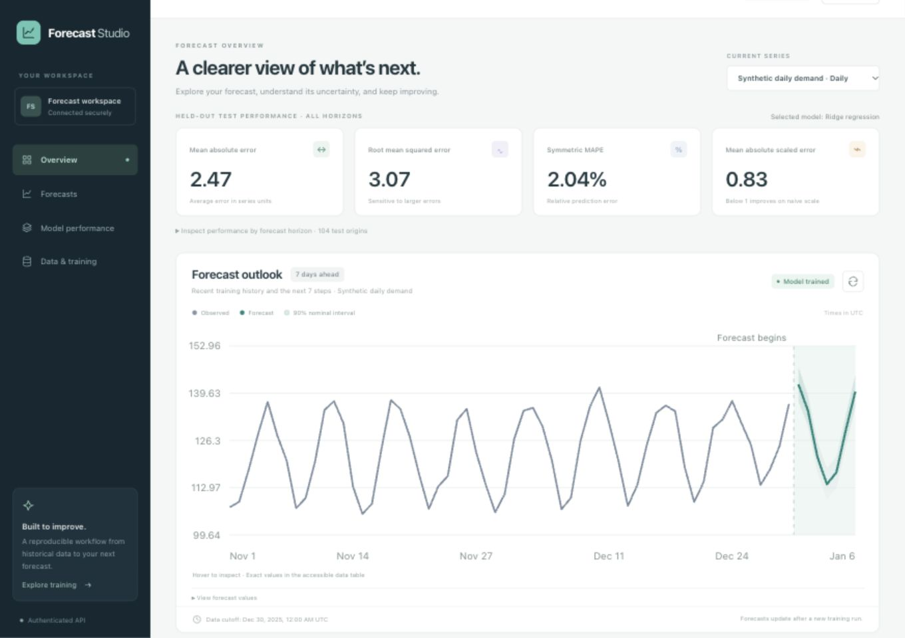

# Verification record

Verified on 1 October 2026 using Python 3.12.14, Node 25.7.0 and an isolated local Postgres 14.18 database. The supplied container/CI targets are Python 3.12, Node 22 and Postgres 18; their execution is not claimed by this record.

| Check | Result | Scope |
| --- | --- | --- |
| Python pipeline | 19 tests passed | Past-only feature mutation checks; target-boundary purging; train-only scaler checks; selection unaffected by later targets; zero-safe metrics; seasonal baseline beyond a season; deterministic repeated training; selected artifact reload; appended-history inference; corrupt artifact rejection; idempotent/conflicting run IDs; internal auth/config/input validation |
| Node API | 9 tests passed, none skipped | JWT policy and trainer permissions; real Postgres tenant isolation; transactional conflict/cadence handling; immutable snapshots; queue deduplication; lease reclamation, fencing, retry exhaustion and single publication; model-result provenance, microsecond timestamp compatibility, intervals and nested horizon metrics; staleness |
| React utility tests | 3 tests passed | Explicit-timezone normalization; impossible dates/nonfinite values/duplicate instants; cadence gaps and undefined metric formatting |
| Frontend build | Passed | Strict TypeScript checking and Vite production compilation |
| End-to-end HTTP smoke | Passed | Unauthorized/reader/cross-tenant denial, series creation, 730-row ingestion, invalid-config rejection, real queued Python training, successful Postgres publication, seven future points, metric retrieval, and unchanged/stale forecasts after new ingestion |
| Connected dashboard | Passed | Signed synthetic test workspace loaded its series; Start training run created a real job; polling displayed succeeded and loaded the resulting forecast/metrics |
| Visual dashboard QA | Passed | Desktop 1360×960 and phone 390×844; no phone horizontal overflow; charts, uncertainty, metrics, disabled demo writes and visible data provenance; no browser errors/warnings during the checked flow |
| Dependency advisories | No known findings at check time | API and React production dependencies via npm audit; Python installed environment via pip-audit |
| Unique-secret setup | Passed | Random 64-character secrets, restrictive file mode, repeat execution preserves existing secrets |
| Compose specification | Passed | Required variables, build contexts, service dependencies and configuration parsed successfully |

The full HTTP check caught two Python/Node compatibility issues: nested per-horizon metrics and generated fractional timestamp precision. These are fixed and covered by regression tests. The final full retraining flow passed after the fixes. A separate dashboard-triggered 80-epoch run also succeeded.

The Python test run emitted one non-failing upstream Starlette warning about its HTTPX test-client compatibility. All 19 assertions passed. Model serving and HTTP training were verified separately through real network requests.

## Demonstration result

The synthetic 730-day series selected ridge regression using tuning data. Fixed-model rolling-origin test metrics across seven horizons and 104 origins were MAE 2.471, RMSE 3.072, sMAPE 2.044%, MASE 0.829, and empirical interval coverage 85.16% against nominal 90%. The dashboard reports the empirical coverage explicitly. These observations do not validate accuracy for the user's real series.

## Remaining verification

Docker's daemon was not running, so image builds and Compose container execution were not tested. Postgres 18 and Node 22 are configured in CI but that remote workflow has not been executed here. No deployment, load test, identity-provider integration, real-data evaluation or existing-repository merge occurred because no existing repository/data were supplied. The documented scaffold paths are ready for those integration milestones.

